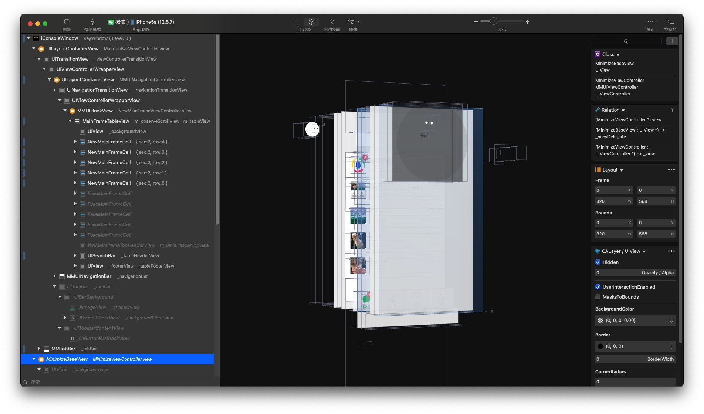
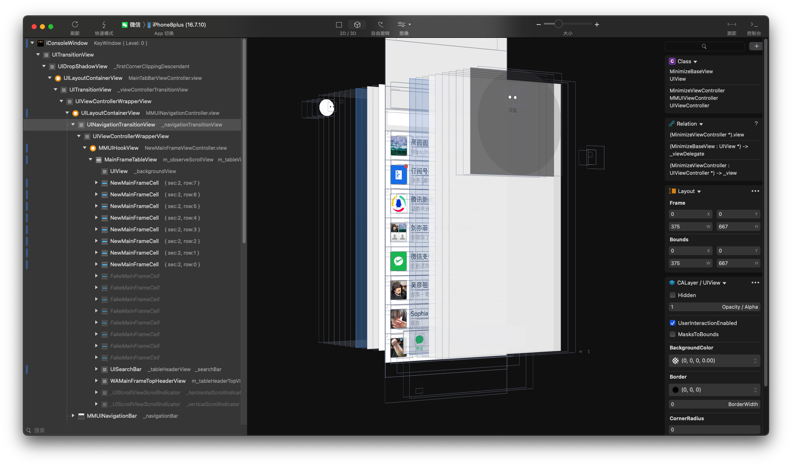

# LookinLoader2

[LooinLoader](https://github.com/creantan/LookinLoader) 的升级版，增加了对 rootless 越狱设备的支持。理论上支持的版本是 iOS 7.0 - iOS 17.5。但是作者只有 iOS 12.5.7 的 rootful 越狱和 iOS 16.7.10 的 rootless 越狱设备。都已成功运行。

iOS12.5.7 rootful 越狱设备截图：

iOS16.7.10 rootless 越狱设备截图：

# 如何安装

可以使用以下两种方式安装

1. 添加软件源 [https://raw.githubusercontent.com/masterking/sileo/refs/heads/main/](https://raw.githubusercontent.com/masterking/sileo/refs/heads/main/)，点击安装使用
2. 下载源码，自行编译安装使用